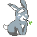

Is the Order a Rabbit?/ご注文はうさぎですか?/請問您今天要來點兔子嗎？

Chino Kafu (香風 智乃, Kafū Chino, usually written as チノ)

Cocoa Hoto (保登 心愛, Hoto Kokoa, usually written as ココア)

Rize Tedeza (天々座 理世, Tedeza Rize, usually written as リゼ)

Chiya Ujimatsu (宇治松 千夜, Ujimatsu Chiya, usually written as 千夜)

Syaro Kirima (桐間 紗路, Kirima Sharo, usually written as シャロ)

Maya Joga (条河 麻耶, Jōga Maya, usually written as マヤ)

Megumi Natsu (奈津 恵, Natsu Megumi, usually written as メグ)

Tippy (ティッピー, Tippī)

Anko (あんこ)

Wild Geese (ワイルドギース, Wairudo Gīsu)

